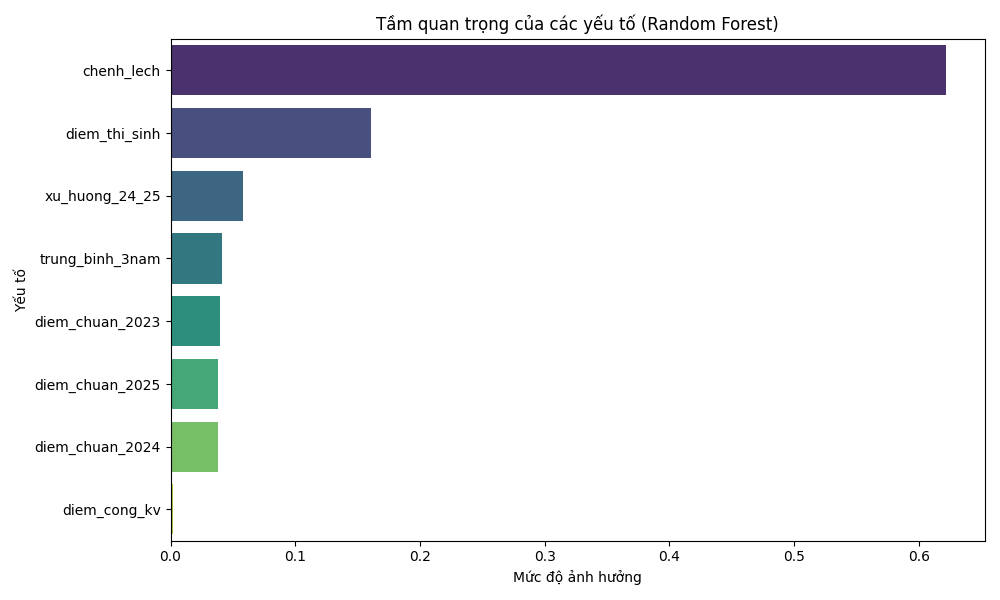
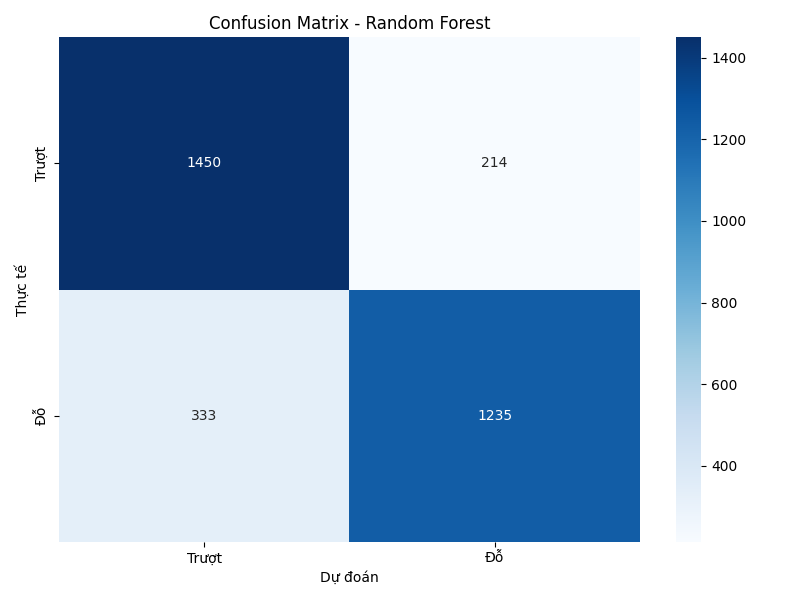

# Hệ Thống Tư Vấn Tuyển Sinh Thông Minh (RAG + ML)

Dự án phát triển hệ thống hỗ trợ tư vấn tuyển sinh đại học, kết hợp sức mạnh của **Machine Learning** (dự đoán xác suất) và **RAG - Retrieval-Augmented Generation** (cung cấp thông tin chi tiết). Hệ thống sử dụng dữ liệu điểm chuẩn thực tế giai đoạn 2023-2025.

---

## 🚀 Các Tính Năng Chính

- **Dự đoán trúng tuyển (ML)**: Sử dụng mô hình Ensemble (Random Forest + Logistic Regression) để tính toán xác suất dựa trên điểm thi, khu vực ưu tiên và xu hướng điểm chuẩn 3 năm.
- **Tư vấn thông minh (RAG)**: Tìm kiếm và trả lời các câu hỏi về ngành nghề, học phí, và thông tin trường dựa trên cơ sở dữ liệu vector (ChromaDB).
- **Chuẩn hóa Mã ngành**: Tự động ánh xạ các mã ngành cũ/biến thể về mã chuẩn 7 chữ số của Bộ GD&ĐT (đầu số 7) để đảm bảo tra cứu chính xác xuyên suốt các năm.
- **Điểm ưu tiên Động**: Tự động tải và áp dụng điểm cộng khu vực từ file cấu hình `data/raw/uu_tien.csv`.
- **Giao diện Autocomplete**: Danh sách chọn ngành đã được làm sạch, mỗi mã ngành chỉ hiển thị một tên gọi chuẩn nhất, giúp người dùng dễ dàng tìm kiếm.

## 📂 Cấu Trúc Dự Án

```text
Project_AI/
├── app/                  # Ứng dụng Web (FastAPI)
│   ├── main.py           # Entry point
│   ├── routes.py         # API Endpoints (/api/tu-van, /api/majors)
│   └── static/           # Giao diện HTML/CSS/JS (Vanilla JS)
├── data/                 # Quản lý dữ liệu
│   ├── raw/              # Dữ liệu gốc (diem_chuan_*.csv, uu_tien.csv)
│   ├── ml_processed_data.csv # Dữ liệu đã gộp và chuẩn hóa mã ngành
│   └── rag_processed_data.json # Văn bản tri thức cho hệ thống RAG
├── models/               # Lưu trữ Model & Scaler (.pkl)
├── src/                  # Mã nguồn xử lý cốt lõi
│   ├── data_processing/  # Gộp dữ liệu, tạo dữ liệu mẫu, điểm ưu tiên
│   ├── ml_model/         # Huấn luyện (train.py) và Dự đoán (predict.py)
│   ├── rag/              # Xây dựng Index và Retriever
│   └── pipeline/         # Inference Pipeline (Kết nối ML + RAG)
└── requirements.txt      # Thư viện phụ thuộc
```

## 🛠️ Hướng Dẫn Cài Đặt

**1. Cài đặt môi trường**
```bash
# Tạo môi trường ảo (Khuyến nghị)
python -m venv venv
venv\Scripts\activate  # Windows
source venv/bin/activate # Linux/Mac

# Cài đặt thư viện
pip install -r requirements.txt
```

**2. Chuẩn bị dữ liệu & Huấn luyện**
Hệ thống cần trải qua quy trình xử lý dữ liệu trước khi chạy:
```bash
# 1. Gộp và chuẩn hóa mã ngành (2023-2025)
python src/data_processing/merge_data.py

# 2. Tạo dữ liệu huấn luyện mẫu (Synthetic)
python src/data_processing/generate_synthetic.py

# 3. Huấn luyện mô hình AI
python src/ml_model/train.py

# 4. Xây dựng chỉ mục tìm kiếm RAG
python src/rag/build_index.py
```

**3. Khởi chạy ứng dụng**
```bash
python app/main.py
```
Hoặc có thể dùng lệnh sau để chạy với uvicorn:
```bash
uvicorn app.main:app --reload
```
Truy cập: `http://localhost:8000`

## 📊 Hiệu năng mô hình

Sau khi huấn luyện, bạn có thể kiểm tra hiệu năng của mô hình qua các biểu đồ trực quan trong thư mục `reports/figures/`:

| Tầm quan trọng của yếu tố | Ma trận nhầm lẫn (Confusion Matrix) |
| :---: | :---: |
|  |  |

> [!NOTE]
> Các biểu đồ này giúp bạn hiểu tại sao AI đưa ra quyết định (Feature Importance) và tỉ lệ dự đoán chính xác thực tế trên tập dữ liệu kiểm tra (Confusion Matrix).

---

## 📊 Quy Trình Xử Lý (Pipeline)

1.  **Dữ liệu đầu vào**: Hệ thống nhận điểm thi, khu vực, khối thi và ngành/trường mục tiêu.
2.  **Chuẩn hóa**: `InferencePipeline` tự động ánh xạ tên trường/ngành sang mã chuẩn.
3.  **ML Inference**:
    - Chuyển dữ liệu điểm chuẩn 3 năm của ngành đó sang dạng ngang (Wide format).
    - Tính toán xu hướng và chênh lệch điểm.
    - Chạy mô hình Ensemble để đưa ra xác suất đỗ (%).
4.  **RAG Context**: Tìm kiếm các tài liệu liên quan đến ngành/trường trong Vector DB.
5.  **Output**: Trả về kết quả dự đoán kèm theo đánh giá định tính và thông tin tư vấn chi tiết từ RAG.

## 🔄 Cập Nhật & Bảo Trì

- **Cập nhật điểm ưu tiên**: Sửa file `data/raw/uu_tien.csv`. Hệ thống sẽ tự động nhận diện thay đổi khi bạn gọi API dự đoán.
- **Thêm dữ liệu điểm chuẩn mới**: Thêm file `.csv` vào `data/raw/` -> Chạy lại script `merge_data.py` -> `train.py`.
- **Duy nhất Mã ngành**: Trong `src/data_processing/merge_data.py`, danh mục `COMMON_MAJOR_MAP` chứa các quy tắc ép mã ngành về đầu số 7 chuẩn hóa.

---
*Dự án được tối ưu hóa cho dữ liệu tuyển sinh Việt Nam giai đoạn 2023-2025.*
