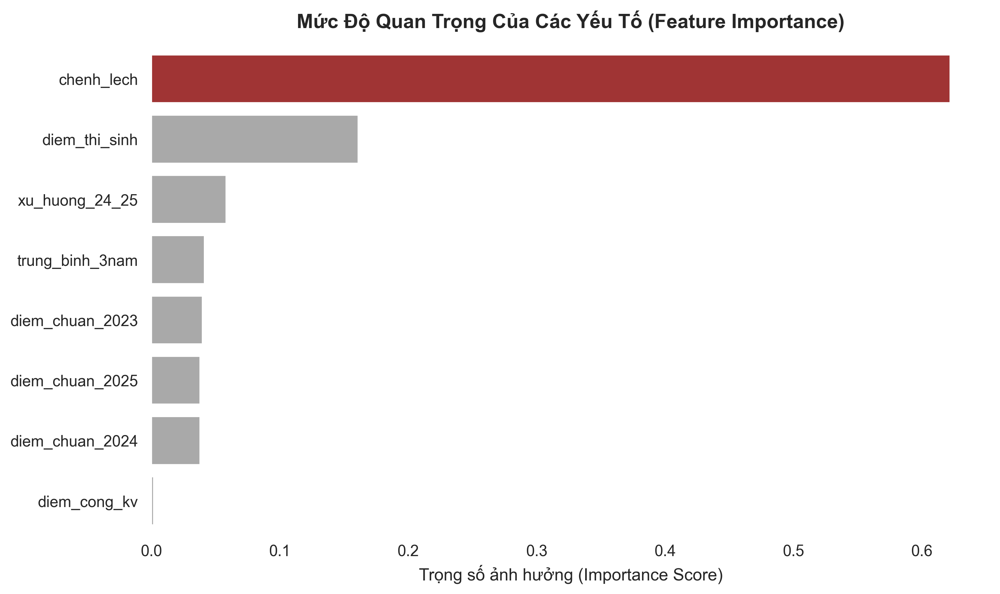
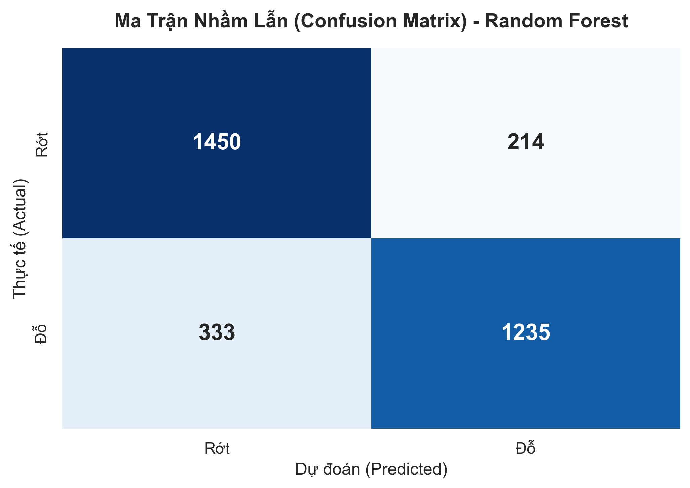
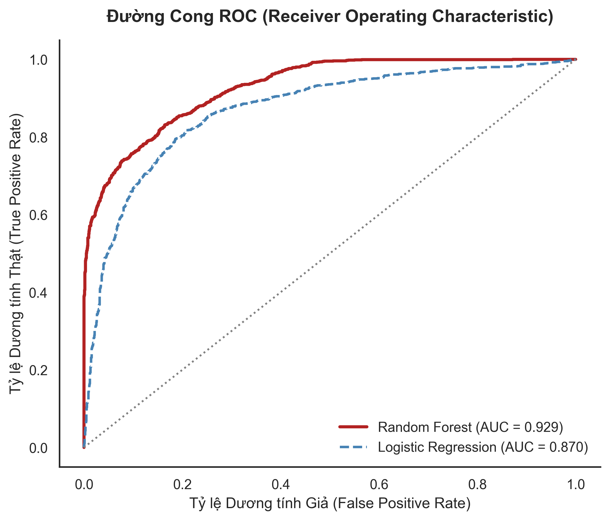

<div align="center">
  <h1>🎓 Hệ Thống Tư Vấn Tuyển Sinh Thông Minh (AI & RAG)</h1>
  <p>Dự án ứng dụng Trí tuệ Nhân tạo để dự đoán xác suất trúng tuyển Đại học, kết hợp Hệ chuyên gia truy xuất (RAG) cung cấp thông tin ngành nghề chuyên sâu.</p>

  [](https://www.python.org/)
  [](https://fastapi.tiangolo.com/)
  [](https://scikit-learn.org/)
  [](https://www.trychroma.com/)
</div>

---

## 🌟 Chức Năng Nổi Bật

- **Dự đoán Trúng tuyển (Machine Learning)**: Sử dụng mô hình Machine Learning Ensemble (kết hợp **Random Forest** và **Logistic Regression**) để phân tích điểm thi, khu vực ưu tiên và điểm chuẩn lịch sử (2023-2025), đưa ra % tỷ lệ đỗ chính xác.
- **Trợ lý Ảo Tư Vấn (RAG)**: Chatbot thông minh tự động trích xuất thông tin (Mã trường, Ngành, Điểm) để tìm kiếm và giải đáp bằng tiếng Việt tự nhiên thông qua cơ sở dữ liệu Vector (ChromaDB).
- **Chuẩn hóa Thông tin Tự động**: Tự động nhận diện và nội suy các điểm số bị thiếu, quy chuẩn mọi mã ngành địa phương về mã chuẩn 7 số của Bộ GD&ĐT.
- **Hệ thống Điểm Ưu Tiên Động**: Có file cấu hình độc lập để tự động tính điểm cộng Khu Vực.

---

## 🤖 Kiến Trúc Mô Hình AI (Model Architecture)

Hệ thống đóng vai trò như một chuyên gia tư vấn tuyển sinh ảo. Ở tầng Machine Learning, mô hình Ensemble khai thác các "luật" ngầm từ dữ liệu lịch sử để phán đoán. Dưới đây là phân tích chi tiết hiệu năng mô hình trên tập kiểm thử (Test Set).

### 1. Yếu Tố Quyết Định (Feature Importance)
Biểu đồ dưới đây minh họa cách mô hình Random Forest đánh giá mức độ quan trọng của các yếu tố đầu vào.
<div align="center">
  
</div>

> **Phân tích:** Mô hình chú trọng lớn nhất vào **Chênh lệch điểm** (giữa điểm thi có cộng ưu tiên của thí sinh và điểm chuẩn gần nhất). Các yếu tố bổ trợ bao gồm *Xu hướng thay đổi điểm (2024-2025)* và *Trung bình điểm 3 năm*, giúp mô hình không bị "mù" khi điểm chuẩn một năm bị biến động bất thường.

### 2. Độ Chính Xác Thực Tế (Confusion Matrix)
Ma trận nhầm lẫn giúp kiểm chứng xem AI có hay bị dự đoán "ảo" hay không.
<div align="center">
  
</div>

> **Phân tích:** Mô hình Random Forest có độ chuẩn xác rất cao, dự đoán sai rất ít trường hợp thí sinh rớt thành đậu. Điều này vô cùng quan trọng đối với một hệ thống tư vấn giáo dục: *Thà dự đoán an toàn (khuyên nhủ dự phòng) còn hơn dự đoán đỗ nhưng thực tế lại trượt*.

### 3. Khả Năng Phân Loại (ROC Curve)
Đường cong ROC so sánh hai thuật toán Machine Learning được triển khai.
<div align="center">
  
</div>

> **Phân tích:** Cả Random Forest (AUC = 0.929) và Logistic Regression (AUC = 0.870) đều thể hiện sức mạnh phân loại xuất sắc. Hệ thống cuối cùng kết hợp mức trung bình có trọng số của cả hai để vừa giữ được khả năng phi tuyến tính của Cây Quyết Định (Trees), vừa bám sát xác suất tuyến tính của Logistic.

---

## 📂 Cấu Trúc Dự Án

```text
Project_AI/
├── app/                  # Ứng dụng Web (FastAPI)
│   ├── main.py           # Entry point
│   ├── routes.py         # API Endpoints (/api/tu-van, /api/majors)
│   └── static/           # Giao diện HTML/CSS/JS (Vanilla JS)
├── data/                 # Quản lý dữ liệu
│   ├── raw/              # Dữ liệu gốc (diem_chuan_*.csv, uu_tien.csv)
│   ├── ml_processed_data.csv # Dữ liệu đã gộp và chuẩn hóa mã ngành
│   └── rag_processed_data.json # Văn bản tri thức cho hệ thống RAG
├── models/               # Lưu trữ Model & Scaler (.pkl)
├── src/                  # Mã nguồn xử lý cốt lõi
│   ├── data_processing/  # Gộp dữ liệu, tạo dữ liệu mẫu, điểm ưu tiên
│   ├── ml_model/         # Huấn luyện (train.py) và Dự đoán (predict.py)
│   ├── rag/              # Xây dựng Index và Retriever
│   └── pipeline/         # Inference Pipeline (Kết nối ML + RAG)
└── requirements.txt      # Thư viện phụ thuộc
```

## 🛠️ Hướng Dẫn Cài Đặt

**1. Cài đặt môi trường**
> [!IMPORTANT]
> Yêu cầu **Python 3.12** để đảm bảo tính tương thích với các thư viện Scikit-Learn và ChromaDB.

```bash
# Tạo môi trường ảo (Khuyến nghị)
python -m venv venv
venv\Scripts\activate  # Windows
source venv/bin/activate # Linux/Mac

# Cài đặt thư viện
pip install -r requirements.txt
```

**2. Chuẩn bị dữ liệu & Huấn luyện**
Hệ thống cần trải qua quy trình xử lý dữ liệu trước khi chạy:
```bash
# 1. Gộp và chuẩn hóa mã ngành (2023-2025)
python src/data_processing/merge_data.py

# 2. Tạo dữ liệu huấn luyện mẫu (Synthetic)
python src/data_processing/generate_synthetic.py

# 3. Huấn luyện mô hình AI
python src/ml_model/train.py

# 3. Khởi tạo kho lưu trữ ngữ nghĩa RAG (Vector DB)
python src/rag/build_index.py
```

**3. Khởi Chạy Server**
```bash
python -m app.main
```
Hoặc có thể dùng lệnh sau để chạy với uvicorn:
```bash
uvicorn app.main:app --reload
```
Truy cập: `http://localhost:8000`

---

## 📊 Quy Trình Xử Lý (Pipeline)

1.  **Dữ liệu đầu vào**: Hệ thống nhận điểm thi, khu vực, khối thi và ngành/trường mục tiêu.
2.  **Chuẩn hóa**: `InferencePipeline` tự động ánh xạ tên trường/ngành sang mã chuẩn.
3.  **ML Inference**:
    - Chuyển dữ liệu điểm chuẩn 3 năm của ngành đó sang dạng ngang (Wide format).
    - Tính toán xu hướng và chênh lệch điểm.
    - Chạy mô hình Ensemble để đưa ra xác suất đỗ (%).
4.  **RAG Context**: Tìm kiếm các tài liệu liên quan đến ngành/trường trong Vector DB.
5.  **Output**: Trả về kết quả dự đoán kèm theo đánh giá định tính và thông tin tư vấn chi tiết từ RAG.

## 🔄 Cập Nhật & Bảo Trì

- **Cập nhật điểm ưu tiên**: Sửa file `data/raw/uu_tien.csv`. Hệ thống sẽ tự động nhận diện thay đổi khi bạn gọi API dự đoán.
- **Thêm dữ liệu điểm chuẩn mới**: Thêm file `.csv` vào `data/raw/` -> Chạy lại script `merge_data.py` -> `train.py`.
- **Duy nhất Mã ngành**: Trong `src/data_processing/merge_data.py`, danh mục `COMMON_MAJOR_MAP` chứa các quy tắc ép mã ngành về đầu số 7 chuẩn hóa.

---
*Dự án được huấn luyện trên khối lượng dữ liệu lịch sử 2023-2025, được thiết kế và tinh chỉnh để sẵn sàng phục vụ kỳ thi THPT Quốc gia 2026.*

